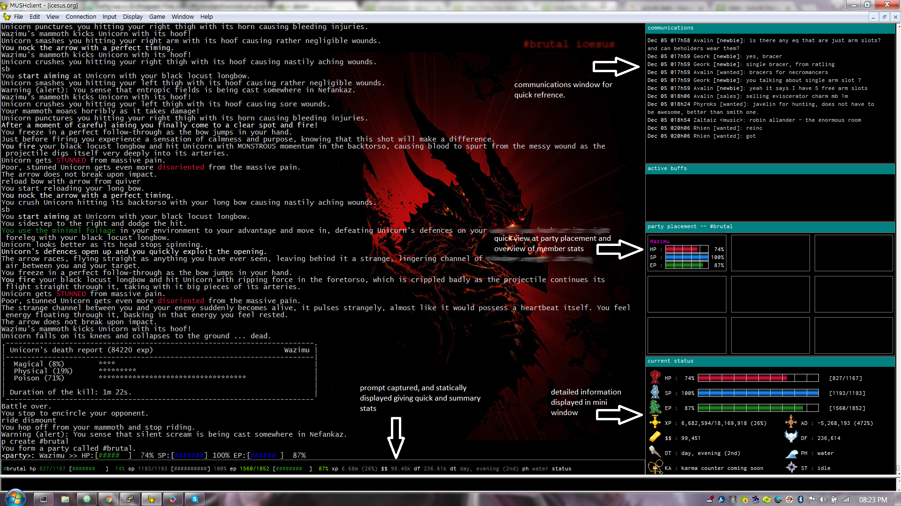
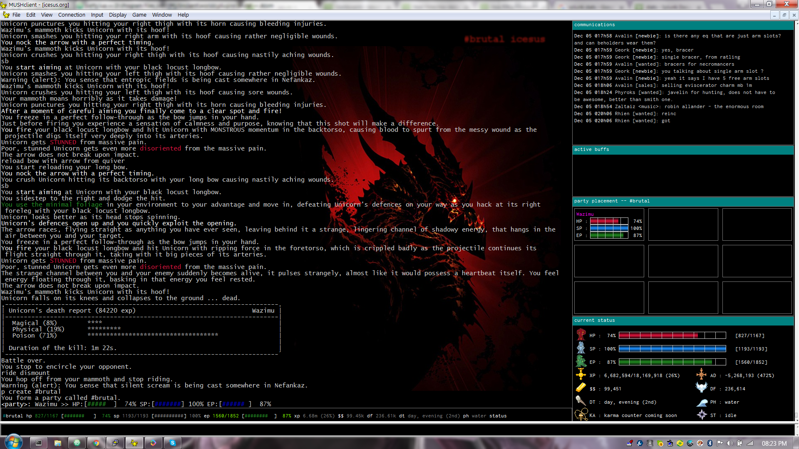

# **#brutal**

This is a mushclient plugin and has been coded by wazimu for use on icesus.org, it is under testing, and may contain bugs and have features not suitable for you or your gameplay.

I recommend to creating a new world in mushclient before installing. This plugin modifies your ingame prompt and can potentially break your other triggers/aliases. While it does try and extract your current prompt configuration and save it into an alias for backup, it is also good to keep your own backup copy of the ingame prompt.

**You have been warned!**

## **#screenshots**
Plugin Features:

Here is how it looks like in action

## **#installing**

* dowload and extract zip file (our use git to clone) into your '..MUSHCLient\worlds\plugin' folder
* edit brutal\config\user.lua file (optional, font type/size)
* create new world in mushclient (highly recommeded)
* connect to icesus.org and login
* click on file, plugins, and add 'brutal.xml' from the brutal-master folder
* type '#brutal config'
* type '#brutal'

## **#known issues, future stuff and notes**
* review icesus 'help triggers'; this plugin does NOT send any game breaking commands. please feel free to contact me if something is a miss.
* graphical elements may look ugly over wine on linux. (nothing i can do about this).
* i might put in scrollbars in the chat window in a future relase.
* buffs window needs some work, need your help for triggers to start and finish off the buff.
* errors may crop up if your internet connection is too laggy.
* need to find a way to reclaim that screen real-estate when not in party.
* do not blame plugin for death, loss of exp etc.
* you can change some variables by editing brutal\config\user.lua such as font, font size.
* plugin modfies the ingame terminal and prompt settings. (help term, help prompt)
* i havent factored psp monitoring and vitae drain, i may code it in future depending if users want it.

## **#uninstalling**
* remove/uninstall plugin from file, plugins
* type '#brutal' to restore your original prompt
* type 'unalias #brutal' to remove saved alias

## **#credits and thanks**
Henrique Lazarini for icons and sprites:

https://opengameart.org/content/496-pixel-art-icons-for-medievalfantasy-rpg

deathwing backdrop image has been modified, original source from:

http://wallpaperswide.com/deathwing-wallpapers.html

Raph Levien for creating the inconsolata font, i sourced from:

https://fonts.google.com/specimen/Inconsolata

Nick and Fendish at mushclient dot com. parts of this plugin would not be possible with the hard work, code, and examples from these gurus.

http://mushclient.com/mushclient/mushclient.htm
