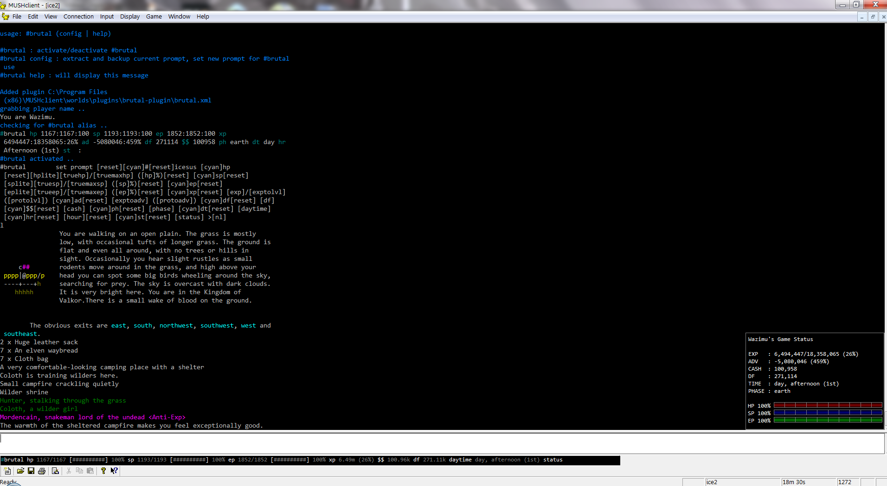

# **#brutal**

This is a mushclient plugin and has been coded by wazimu for use on icesus.org, it is under testing, and may contain bugs and have features not suitable for you.

I recommend to creating a new world in mushclient before installing this plugin. also good to keep a backup copy of your ingame prompt settings. This plugin modifies your ingame prompt and can potentially break your other triggers/aliases.

**You have been warned!**

This plugin will add an infobar and a floating miniwindow in mushclient
## **#screenshot**

## **#installing**

* dowload and extract zip file into your '..MUSHCLient\worlds\plugin' folder
* create new world in mushclient
* connect to icesus.org and login
* click on file, plugins, and add 'brutal.xml' from the brutal-master folder
* type #brutal config
* type #brutal

## **#notes**
* errors may crop up if your internet connection is too laggy
* every care has been taken not to violate games rules on "help triggers". if you feel a part of my code violates/breaks these rules. please mudmail/tell me immediately.
* with above point, triggers are set based from input from the prompt. if the prompt is not updated manually (by being unilde) then values may not correspond to real values.
* you can change some variables by editing brutal\config\user.lua such as font, font size and even install my personal brutal colour scheme.

## **#todo and coming soon**

* setup a chat mini floating window
* setup a party mini floating window
