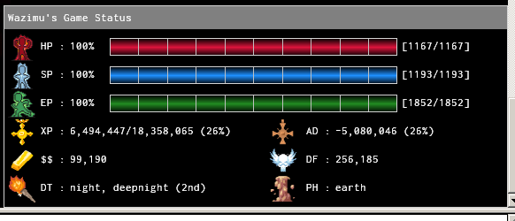
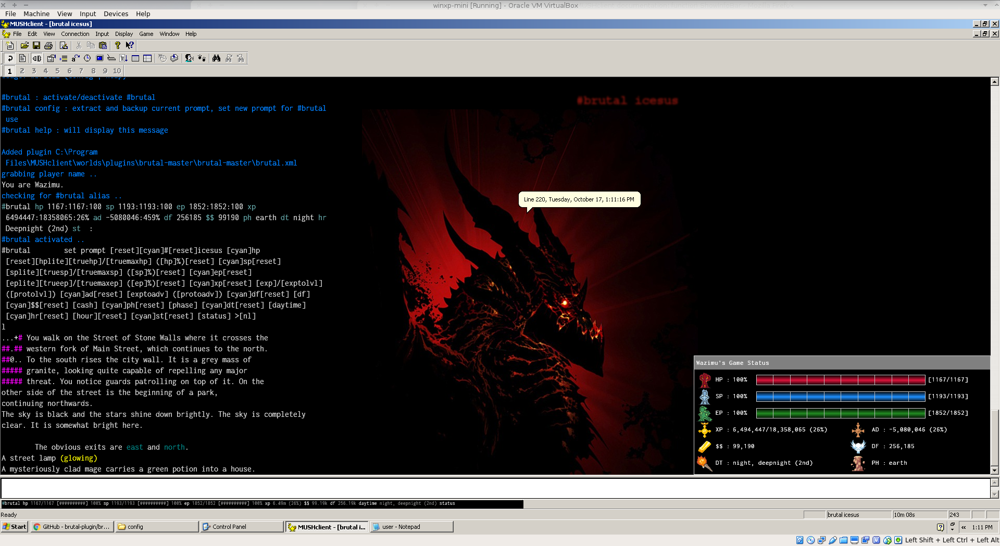
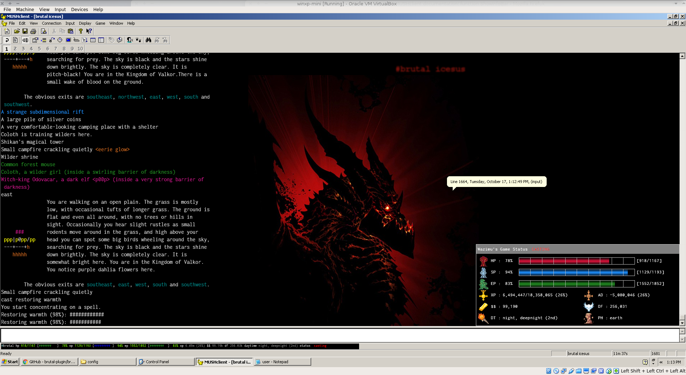

# **#brutal**

This is a mushclient plugin and has been coded by wazimu for use on icesus.org, it is under testing, and may contain bugs and have features not suitable for you or your gameplay.

I recommend to creating a new world in mushclient before installing. This plugin modifies your ingame prompt and can potentially break your other triggers/aliases. While it does try and extract your current prompt configuration and save it into an alias for backup, it is also good to keep your own backup copy of the ingame prompt.

**You have been warned!**

## **#screenshots**
This plugin will dynamically capture your prompt and display it on the infobar:

Additional information will be captured and displayed in a floating mini window:

This is how my muschlient looks like when im idle:

And when there is some action

## **#installing**

* dowload and extract zip file (our use git to clone) into your '..MUSHCLient\worlds\plugin' folder
* edit brutal\config\user.lua file (optional, font type/size)
* create new world in mushclient (highly recommeded)
* connect to icesus.org and login
* click on file, plugins, and add 'brutal.xml' from the brutal-master folder
* type '#brutal config'
* type '#brutal'

## **#notes**
* errors may crop up if your internet connection is too laggy
* every care has been taken not to violate games rules on "help triggers". if you feel a part of my code violates/breaks these rules. please mudmail/tell me immediately.
* with above point, triggers are set based from input from the prompt. if the prompt is not updated manually (by being unilde) then values may not correspond to real values.
* you can change some variables by editing brutal\config\user.lua such as font, font size.

## **#uninstalling**
* remove/uninstall plugin from file, plugins
* type '#brutal' to restore your original prompt
* type 'unalias #brutal' to remove saved alias

## **#todo and coming soon**

* setup a chat mini floating window
* setup a party mini floating window

## **#credits**
thanks to Henrique Lazarini for icons and sprites:

https://opengameart.org/content/496-pixel-art-icons-for-medievalfantasy-rpg

deathwing backdrop image has been modified, original source from:

http://wallpaperswide.com/deathwing-wallpapers.html

thanks to the creators of the font inconsolata, i sourced from:

https://fonts.google.com/specimen/Inconsolata

most code has been written from scratch, using templates and examples from the muschlient forums.
Many thanks to the all the devs there.

http://mushclient.com/mushclient/mushclient.htm

http://mushclient.com/functions
